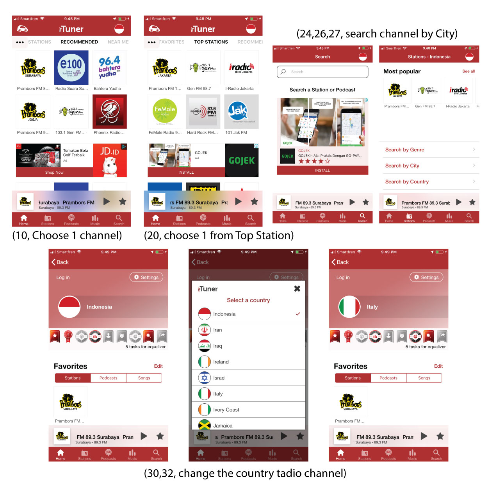

# Contextual Inquiry and Analysis
## App Description
The application in iPhone that allows you to stream the radio channel in Indonesia and another country.
## Instruction Script
- Open the application
- Choose 1 channel and stream it randomly
- Mention the categories from the menu
- Choose 1 channel from "Top Station" category
- Search station by the City in "Station" menu
- Try to change the streaming channel country
## User Description
- User is male
- He was 22 years old
- He was studied in Communication
- He was operate the application for the first time
- Active in social media
## Transcript
Buyung: The interviewer
A	    : The interviewee
1. Buyung	: Apakah sudah pernah menggunakan aplikasi streaming radio sebelumnya?
2. A		  : Belum pernah tu, soalnya juga jarang mendengarkan radio
3. Buyung	: Oh kalo begitu, sekarang coba operasikan aplikasi streaming radio di HP saya
4. A		  : Baik, mana?
5. Buyung	: Silakan *memberikan hp saya yang sudah terbuka lock-nya*
6. A		  : Ini aplikasinya yang iconnya gambar radio ya?
7. Buyung	: Iya betul. Silakan dibuka 
8. A		  : Oke
9. Buyung	: Sekarang silakan pilih satu channel radio untuk streaming
10. A		  : Oke... Kalau sudah, lalu apa? Ini sudah muncul suaranya
11. Buyung: Baiklah, berarti tidak ada kesulitan ya? 
12. A		  : Tidak, karena sudah terlihat pilihan radionya
13. Buyung: Kalau boleh tau, tadi radio yang dipilih masuk kategori apa ya?
14. A		  : Sebentar... *beberapa saat* Oh, recommended!
15. Buyung: Lalu sekarang coba sebutkan kategori radio yang ada
16. A		  : Ini saya agak bingung. Apakah menu yang tiga titik di kiri atas ini juga termasuk?
17. Buyung: Coba dipahami dulu saja
18. A		  : Oh iya saya paham, ini sama saja ternyata. Saya bisa geser dan pilih di tombol titik tiga di kiri atas ini.
19. Buyung: Baiklah. Sekarang coba pilih salah satu radio dari kategori Top Station
20. A		  : Sudah *sambil menggeser tampilan dari layar, tidak menggunakan tombol menu*
21. Buyung: Kalau boleh tau, asalnya dari mana?
22. A 		: Saya dari jogja
23. Buyung: Baiklah kalo begitu, sekarang coba cari channel radio yang ada di Jogja
24. A		  : Baiklah... *menggeser kembali tampilan layar, langsung menuju menu Search* Tapi di sini tulisannya 'Search a Station or Podcast'
25. Buyung: Memang itu sebenarnya digunkanan untuk mencari channel radio berdasarkan namanya
26. A		  : Oke, sebentar.... Ini saya ketemu di menu Station
27. A		  : Sudah ketemu, Yogyakarta. Tapi saya tidak bisa input kata untuk mencari lebih cepat, harus scroll down
28. Buyung: Iya benar, memang tidak ada kolom search di halaman itu.
29. Buyung: Ini kan aplikasinya bisa streaming radio dari beberapa negara. Negara yang sekarang ini kan Indonesia, coba diganti. Bisa?
30. A		  : Sebentar saya mencari menu setting-nya dulu. Ini di menu bar bawah tidak ada.
31. Buyung: Coba diteliti lagi
32. A		  : Oh mungkin di bendera itu... Oke, benar. Sudah. Sudah saya ganti negara Italia
33. Buyung: Baiklah, terima kasih atas waktunya mas. Mohon maaf kalau mengganggu waktunya
34. A		  : Sama sama.
## Models and Annotations
### Artifact Model

### Flow Model

### Cultural Model

## Do's and Don't's
### Do's 
- Give search column in menu 'Search by City'
- Appear the setting button in homepage
### Don't's
- Don't place the menu thee dots button (Category menu) if the user possible to slide the screen to change the category
